English | [日本語](./README.ja.md)

# FIA Practical Sample

This repository is a sample iOS application implemented in Swift, based on the design concept of [Clean Architecture](https://blog.cleancoder.com/uncle-bob/2011/11/22/Clean-Architecture.html) adapted to [Framework-Independent Architecture (FIA)](https://github.com/suguruTakahashi-1234/framework-independent-architecture).

## Demo

<div align="center">

</div>

#### Repository About
[](https://github.com/suguruTakahashi-1234/fia-practical-sample/blob/main/LICENSE.md)
[](https://github.com/suguruTakahashi-1234/fia-practical-sample/stargazers)
[](https://github.com/suguruTakahashi-1234/fia-practical-sample/watchers)
[](https://github.com/suguruTakahashi-1234/fia-practical-sample/network/members)
[](https://github.com/suguruTakahashi-1234/fia-practical-sample/graphs/contributors)
[](https://github.com/suguruTakahashi-1234/fia-practical-sample/releases)
[](https://github.com/suguruTakahashi-1234/fia-practical-sample)
[](https://github.com/suguruTakahashi-1234/fia-practical-sample)

#### Issue & PR

[](https://github.com/suguruTakahashi-1234/fia-practical-sample/issues)
[](https://github.com/suguruTakahashi-1234/fia-practical-sample/pulls)
[](https://github.com/suguruTakahashi-1234/fia-practical-sample/issues?q=is%3Aissue+is%3Aclosed)
[](https://github.com/suguruTakahashi-1234/fia-practical-sample/pulls?q=is%3Apr+is%3Aclosed)

#### Release & Tag

[](https://github.com/suguruTakahashi-1234/fia-practical-sample/tags)
[](https://github.com/suguruTakahashi-1234/fia-practical-sample/releases)
[](https://github.com/suguruTakahashi-1234/fia-practical-sample/releases)
[](https://github.com/suguruTakahashi-1234/fia-practical-sample)

#### Commit Activity

[](https://github.com/suguruTakahashi-1234/fia-practical-sample/commits)
[](https://github.com/suguruTakahashi-1234/fia-practical-sample)
[](https://github.com/suguruTakahashi-1234/fia-practical-sample)
[](https://github.com/suguruTakahashi-1234/fia-practical-sample)
[](https://github.com/suguruTakahashi-1234/fia-practical-sample/commits)

#### Workflow Status

[](https://github.com/suguruTakahashi-1234/fia-practical-sample/actions/workflows/tag_and_release_note_gen.yml)
[](https://github.com/suguruTakahashi-1234/fia-practical-sample/actions/workflows/swift_docc_hosting.yml)
[](https://github.com/suguruTakahashi-1234/fia-practical-sample/actions/workflows/multilingual_readme_check.yml)

#### Repobeats


## Development

### Requirement


- macOS
  - 14.4.1 or Later
- Xcode
  - 15.3 or Later, with Swift 5.10
  - Download from [Xcode Releases](https://xcodereleases.com)
- npm
  - 10.5.1 or Later
  - Install using your preferred method, e.g., [nodebrew](https://github.com/hokaccha/nodebrew)
  - Used to run npx [mermaid-cli](https://github.com/mermaid-js/mermaid-cli)

### Supported Platform


- iOS
  - 17.4 or Later
- iPadOS
  - 17.4 or Later

### Supported Language

- Japanese (default)
- English

### Technical Elements

- **Architecture**
  - Adaptation of [Framework-Independent Architecture (FIA)](https://github.com/suguruTakahashi-1234/framework-independent-architecture) based on the design concepts of [Clean Architecture](https://blog.cleancoder.com/uncle-bob/2011/11/22/Clean-Architecture.html)
  - Multi-Modules, Multi-Projects configuration via Swift Package Manager
- **Testing**
  - Writing test code using [swift-testing](https://github.com/apple/swift-testing)
  - Automated generation of test mocks with [Mockolo](https://github.com/uber/mockolo)
  - Snapshot testing of SwiftUI Previews with [PreviewSnapshots](https://github.com/doordash-oss/swiftui-preview-snapshots)
  - Multilingual testing support with TestPlan
  - UI testing with XCUITest
- **Swift 6 Support**
  - Support for Swift Concurrency Checking Complete
  - Implementation of protocols using `any`/`some`
    - No use of `any protocol`, implemented entirely with `some protocol`
- **Embracing New Technologies**
  - Data binding with [Observation](https://developer.apple.com/documentation/observation)
  - Multilingual support with [String Catalogs](https://developer.apple.com/documentation/xcode/localizing-and-varying-text-with-a-string-catalog)
- **Improving Development Experience**
  - CI/CD with Xcode Cloud
  - Automatic generation of boilerplate code with [Sourcery](https://github.com/krzysztofzablocki/Sourcery)
  - Static analysis of unused code with [Periphery](https://github.com/peripheryapp/periphery)
  - Management of library updates with [Renovate](https://github.com/renovatebot/renovate) ([Dashboard Issue](https://github.com/suguruTakahashi-1234/fia-practical-sample/issues/38))
  - Documentation as Code initiative with [Swift-DocC](https://www.swift.org/documentation/docc/)
  - Hosting of [Swift-DocC](https://www.swift.org/documentation/docc/) with GitHub Actions
- **Library Management**
  - Swift Package Manager
  - [Mint](https://github.com/yonaskolb/Mint) (introduced via Swift Package Manager)

## Getting Started

### Clone Repository

```shell
$ git clone https://github.com/suguruTakahashi-1234/fia-practical-sample.git
$ cd fia-practical-sample
```

### Setup

The following `make setup` command will apply the settings in [Mint](https://github.com/yonaskolb/Mint) and [githooks](https://git-scm.com/docs/githooks) and open `. xcworkspace` and Xcode will be launched.

```shell
$ make setup
```

The process that `make setup` executes is described in [Makefile](./Makefile), and a list of defined make commands is displayed by running `make help`.

## Swift Package Manager Dependencies Diagrams

By executing the following make command, Mermaid files for Swift Package Manager dependencies will be generated (by [depermaid](https://github.com/daikimat/depermaid), [mermaid-cli](https://github.com/mermaid-js/mermaid-cli)).

```shell
$ make spm-dependencies-mermaid-gen
```

The generated Mermaid is as follows.

### My Targets


### Including Test Targets



### Including Library



### Including All



## CI/CD

### Xcode Cloud

The CI/CD environment for this project is built by Xcode Cloud.

Currently, only GUI operations are officially supported for Xcode Cloud configuration, and configuration files are not exported or managed via GitHub.

### GitHub Actions

The project has the following GitHub Actions set up to aid development.

- [Host Swift-DocC](https://github.com/suguruTakahashi-1234/fia-practical-sample/actions/workflows/swift_docc_hosting.yml)
- [Generate Tag & Release Note](https://github.com/suguruTakahashi-1234/fia-practical-sample/actions/workflows/tag_and_release_note_gen.yml)

## Documents

The GitHub Actions of [Host Swift-DocC](https://github.com/suguruTakahashi-1234/fia-practical-sample/actions/workflows/swift_docc_hosting.yml) are hosting the Swift-DocC of the domain layer code at the following link.

- [DomainLayer](https://sugurutakahashi-1234.github.io/fia-practical-sample/documentation/domainlayer/)

## Contributing

[](https://github.com/suguruTakahashi-1234/fia-practical-sample/graphs/contributors)

Thank you for your interest in contributing! 🌟

Please check out our [CONTRIBUTING](./CONTRIBUTING.md) and [CODE_OF_CONDUCT](./CODE_OF_CONDUCT.md) for guidelines on how to contribute.

## License

[](https://github.com/suguruTakahashi-1234/fia-practical-sample/blob/main/LICENSE.md)

See the [LICENSE](./LICENSE.md) file for license rights and limitations (MIT).

## Contact

For questions or collaborations, please feel free to contact us on [](https://twitter.com/ikuraikuraaaaaa)
 or [GitHub Issue](https://github.com/suguruTakahashi-1234/fia-practical-sample/issues).
