# DISample

## Swift-DocC

- [Domainlayer](https://sugurutakahashi-1234.github.io/DISample/documentation/domainlayer/)

## Swift Package Manager Dependencies Diagrams

### My Targets

### Including Test Targets

### Including Library

### Including All

